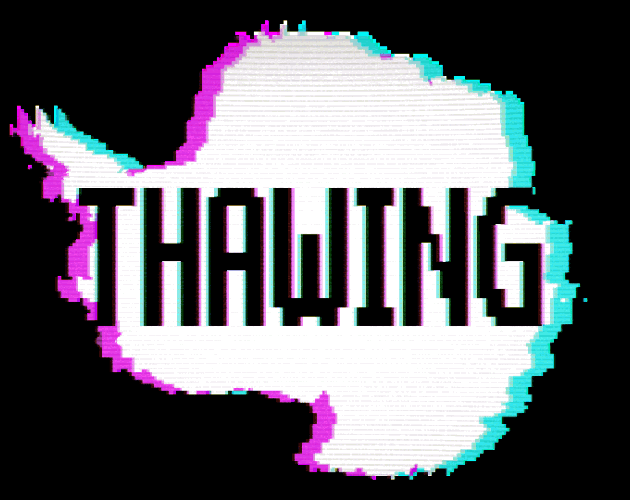

# Thawing

My entry for the Accessibility Jam 2022 (Hand Tremors). Made in Godot.

## Credits

A game by Sander in 't Veld. Code for *input_controller.gd* was written for a previous project.

The following free assets were used:
- ["Sci-fi User Interface Elements" by Buch](https://opengameart.org/content/sci-fi-user-interface-elements), modified;
- ["10 pixel art portraits" by Buch](https://opengameart.org/content/10-pixel-art-portraits), modified;
- ["Pixel Worker Sprite" by domsson](https://opengameart.org/content/pixel-worker-sprite-fukushima), modified;
- ["Isometric houses" by Hansjörg Malthaner](https://opengameart.org/content/isometric-houses-64px-raster);
- ["VHS and CRT monitor effect" shader by pend00](https://godotshaders.com/shader/vhs-and-crt-monitor-effect/), modified;
- ["Pondering the Cosmos" by Ruskerdax](https://opengameart.org/content/pondering-the-cosmos);
- ["Osare (Unrest Theme)" by Brandon Morris](https://opengameart.org/content/osare-unrest-theme);
- ["Last stand in space" by Brandon Morris](https://opengameart.org/content/last-stand-in-space);
- ["Dark Ambience" (chewing gum) by SpringySpringo](https://opengameart.org/content/dark-ambience-0);
- ["Force field electrim hum" by Varkalandar](https://opengameart.org/content/force-field-electric-hum), modified;
- ["50 CC0 Sci-Fi SFX" by rubberduck](https://opengameart.org/content/50-cc0-sci-fi-sfx);
- [Retro Gaming font by Daymarius](https://www.dafont.com/retro-gaming.font);
- [Motorola Screentype font by R P N](https://www.dafont.com/motorola-screentype.font);
- [Controller buttons by Arks](https://arks.itch.io/ps4-buttons);
- [Godot Accessibility plugin by Nolan Darilek](https://github.com/lightsoutgames/godot-accessibility), modified;
- Proposed flag of Antarctica by Tobias Jakobs.

Color palette was partially based on [2bitdemichrome by Toby_Yasha](https://lospec.com/palette-list/2bit-demichrome) and [darkseed16 by Ricardo Juchem](https://lospec.com/palette-list/darkseed-16).

## License
This game was made by Sander in 't Veld. Its source code is made available to you under the MIT License, as specified in *LICENSE.txt*.

The software is provided "as is", without warranty of any kind, express or implied, including but not limited to the warranties of merchantability, fitness for a particular purpose and noninfringement. In no event shall the authors or copyright holders be liable for any claim, damages or other liability, whether in an action of contract, tort or otherwise, arising from, out of or in connection with the software or the use or other dealings in the software.

## Links

- [Play Thawing on itch.io](https://sliv.itch.io/thawing)
